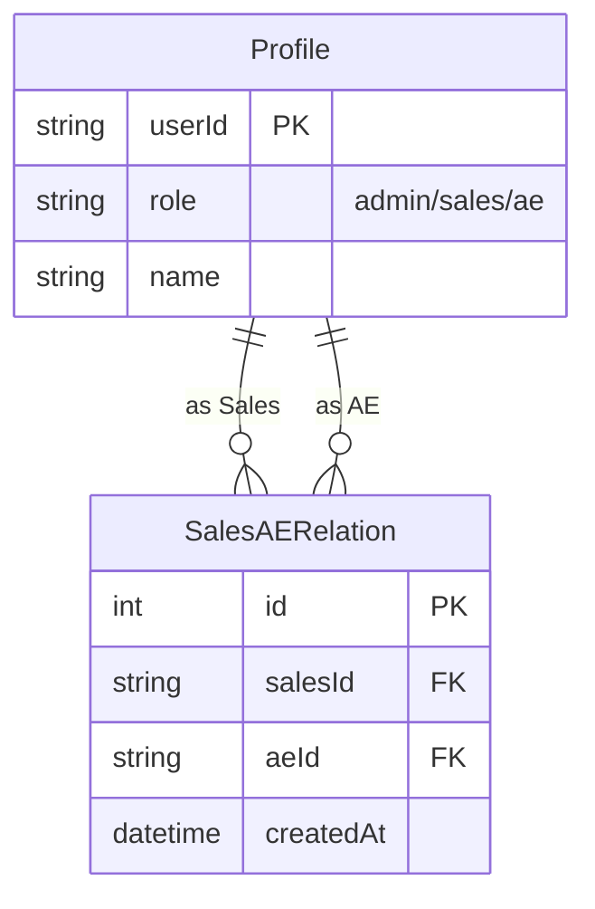

# 数据权限管理 (VL-SYS-001)

## 1. 简介
### 1.1 背景与目的
为了保障客户数据的安全性，同时满足业务团队的协作需求，需要建立基于角色的数据权限管理体系。核心需求是实现销售（Sales）与优化师（AE）的关联绑定，并基于此关联控制数据的可见性。

### 1.2 适用范围
- 系统管理员：配置 Sales 和 AE 的对应关系。
- 销售人员：查看自己负责的客户数据。
- 优化师：查看自己直接负责的客户数据，以及关联销售负责的客户数据。

## 2. 用户角色与权限

| 角色 | 代码 | 权限描述 |
|---|---|---|
| 管理员 | `admin` | 拥有所有权限，可查看所有数据，配置 Sales-AE 关系。 |
| 销售人员 | `sales` | 仅可见自己作为“签约销售”或“负责销售”的客户数据。 |
| 优化师 | `ae` | 可见自己作为“负责 AE”的客户数据 + **关联的销售人员**负责的客户数据。 |

## 3. 功能需求

### 3.1 Sales-AE 关系配置
**功能点 ID**: `VL-SYS-001-01`
**用户故事**: 作为管理员，我需要将 AE 分配给 Sales，以便他们可以协同服务客户。

**交互流程**:
1. 进入“权限管理” -> “Sales-AE 关系配置”页面。
2. 页面展示所有销售人员列表。
3. 点击某个销售的“关联 AE”按钮。
4. 弹出“选择 AE”对话框（支持搜索、多选）。
5. 确认后，建立 Sales 与选中 AE 的关联关系。
6. 支持在列表中直接移除关联。

**规则**:
- 关系为多对多：一个 Sales 可以关联多个 AE，一个 AE 也可以服务多个 Sales。

### 3.2 数据权限过滤
**功能点 ID**: `VL-SYS-001-02`
**用户故事**:
- 作为销售，登录系统后，在 VL 用户列表只能看到我的客户，看不到其他销售的客户。
- 作为 AE，登录系统后，我能看到我直接负责的客户，也能看到我服务的销售名下的所有客户。

**逻辑说明**:
- **Sales 视图**:
  ```sql
  SELECT * FROM vlusers 
  WHERE signSales = :currentUserName 
     OR responsibleSales = :currentUserName
  ```
- **AE 视图**:
  ```sql
  -- 1. 查找关联的销售
  salesIds = SELECT salesId FROM sales_ae_relations WHERE aeId = :currentUserId
  salesNames = SELECT name FROM profiles WHERE userId IN salesIds
  
  -- 2. 查询数据
  SELECT * FROM vlusers
  WHERE responsibleAE LIKE '%' + :currentUserName + '%' -- 直接负责
     OR signSales IN salesNames                       -- 关联销售签约
     OR responsibleSales IN salesNames                -- 关联销售负责
  ```

## 4. 数据模型

### 4.1 实体关系图 (ERD)



### 4.2 数据库表结构

**表名**: `sales_ae_relations`

| 字段名 | 类型 | 必填 | 说明 |
|---|---|---|---|
| id | INTEGER | 是 | 主键，自增 |
| salesId | TEXT | 是 | 销售用户 ID，外键关联 profiles.userId |
| aeId | TEXT | 是 | AE 用户 ID，外键关联 profiles.userId |
| createdAt | TEXT | 否 | 创建时间 |

## 5. 验收标准
1. **关系配置**:
   - [ ] 管理员可以成功绑定 Sales 和 AE。
   - [ ] 管理员可以成功解绑 Sales 和 AE。
   - [ ] 绑定关系在数据库中正确存储。
2. **Sales 权限**:
   - [ ] 切换为 Sales 角色登录。
   - [ ] VL 用户列表仅显示该 Sales 负责的数据。
   - [ ] 无法通过 URL 参数访问其他 Sales 的数据（Mock 层面暂只做列表过滤，接口级鉴权待后续完善）。
3. **AE 权限**:
   - [ ] 切换为 AE 角色登录。
   - [ ] VL 用户列表显示：自己直接负责的数据 + 关联 Sales 的数据。
   - [ ] 解绑某个 Sales 后，刷新列表，该 Sales 的数据应不再显示。


